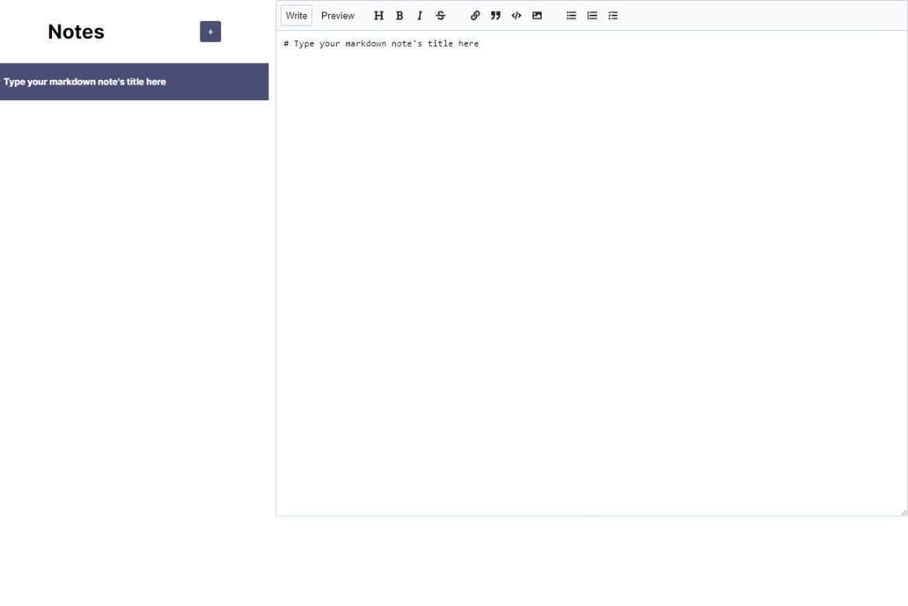
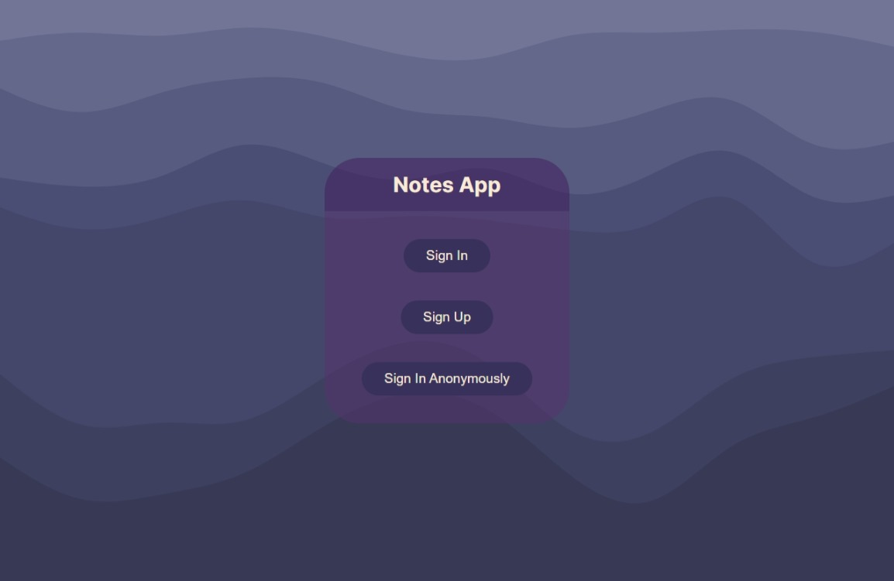
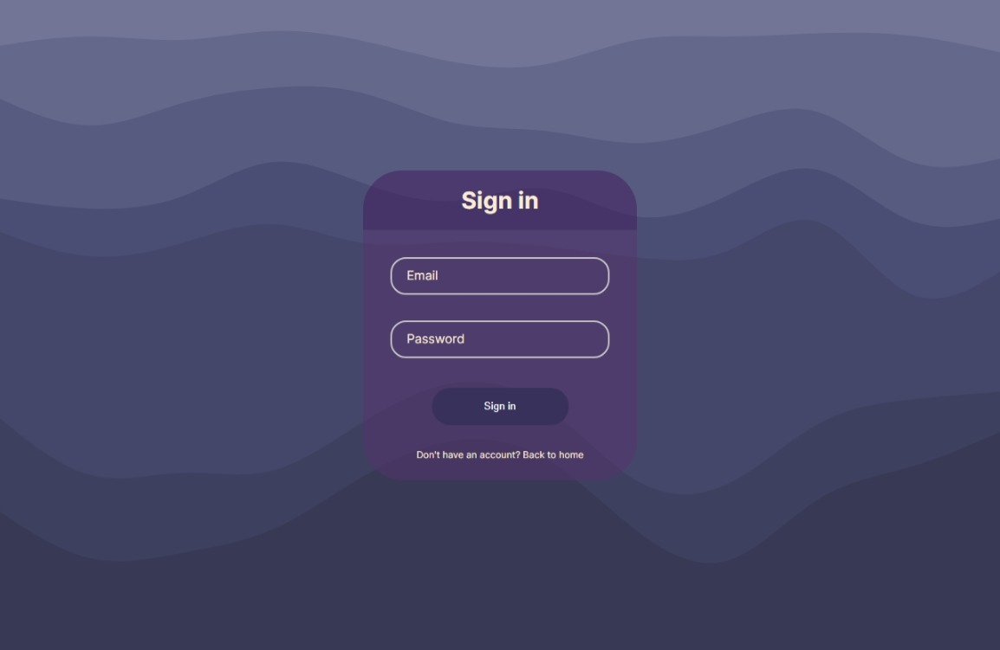
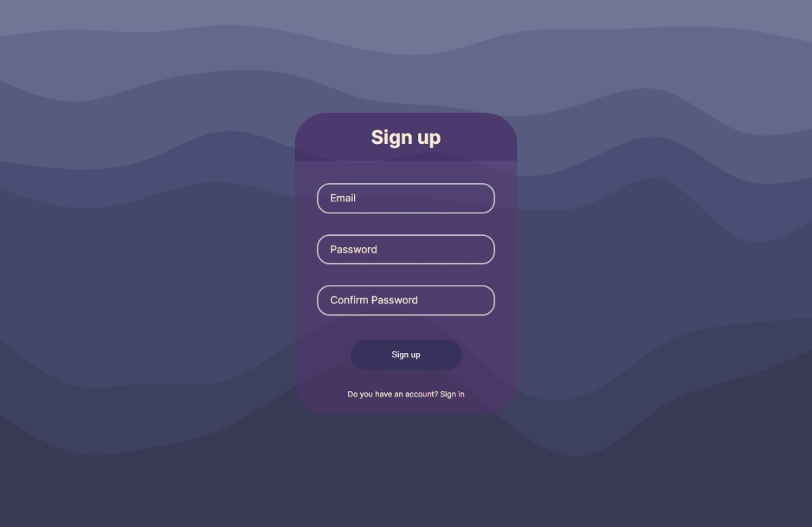
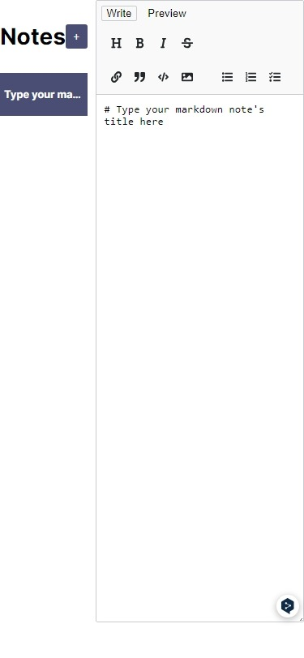
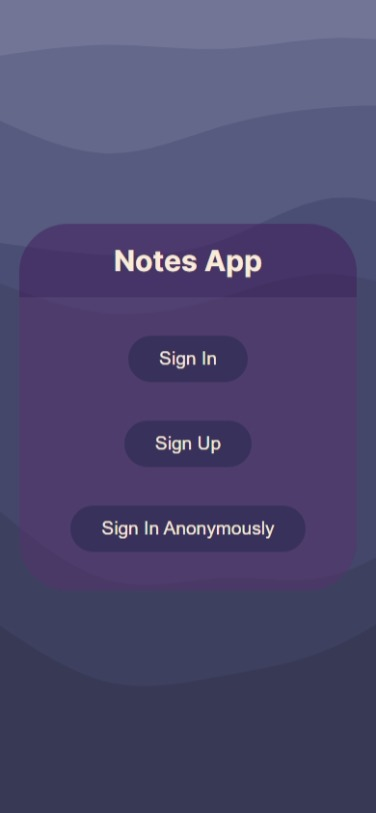
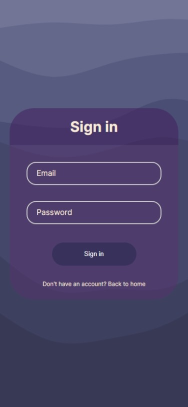
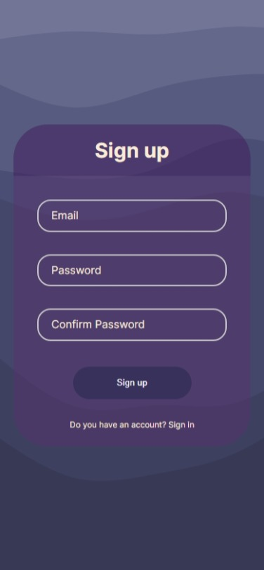

# NextJS Project - Notes App
The Notes App project is built with NextJS and uses Firebase to store the notes that users enter. 
## Technologies Used 
 - NextJS 
 - CSS 
 - Firebase
## The Challenge 
The Notes App website is responsible for storing and displaying users' notes. It also allows them to be displayed in Markdown format.

Users can register with their email and password or log in to the application anonymously, with the possibility of passing their account to a registered user. 

All authentication and storage of the application is managed with Firebase.  

## Screenshots 

Desktop version

Mobile version

# [Website Live](https://notes-app-next-araujocesarr.vercel.app/)
## Auhor 
-   Email -  [cesararaujo.perez@gmail.com](mailto:cesararaujo.perez@gmail.com)
